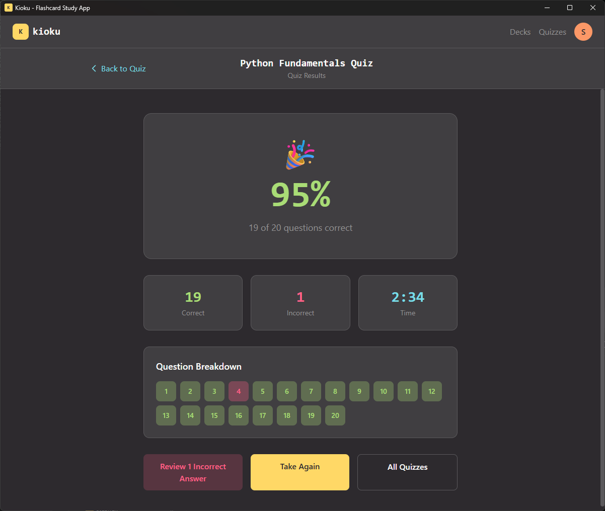

<p align="center">
  
</p>

<h1 align="center">Kioku</h1>

<p align="center">
  <strong>A beautiful offline flashcard and quiz app for developers</strong>
</p>

<p align="center">
  
  
  
</p>

---

Kioku (記憶 - Japanese for "memory") is a local-first desktop application for creating and studying flashcards and quizzes. Built with Tauri and React, it features syntax highlighting for 50+ programming languages, making it perfect for developers learning new technologies.

## Screenshots

<div align="center">
<table>
  <tr>
    <td align="center"><strong>Decks Dashboard</strong></td>
    <td align="center"><strong>Quizzes Dashboard</strong></td>
  </tr>
  <tr>
    <td></td>
    <td></td>
  </tr>
  <tr>
    <td align="center"><strong>Deck View</strong></td>
    <td align="center"><strong>Study Mode</strong></td>
  </tr>
  <tr>
    <td></td>
    <td></td>
  </tr>
  <tr>
    <td align="center"><strong>Quiz Question</strong></td>
    <td align="center"><strong>Quiz Results</strong></td>
  </tr>
  <tr>
    <td></td>
    <td></td>
  </tr>
</table>
</div>

## Features

### Flashcard Decks
- Create decks with text or code content
- Syntax highlighting for 50+ programming languages
- Flip cards with click, tap, or keyboard (Space/Enter)
- Navigate with arrow keys or swipe gestures
- Shuffle cards for varied practice
- Listen mode with text-to-speech

### Quizzes
- Multiple choice and fill-in-the-blank questions
- Support for multiple correct answers
- Instant feedback with explanations
- Score tracking and review
- Shuffle questions option

### Organization
- Tag cards and questions for filtering
- Filter by any/all selected tags
- Search within decks
- Study filtered subsets

### Import/Export
- JSON import/export for decks and quizzes
- Drag-and-drop file import
- Bulk export from settings
- Share content between devices

### Statistics
- Track study sessions and time
- Monitor cards reviewed
- Quiz attempt history with scores
- Per-deck and per-quiz breakdowns

## Installation

### Download

Download the latest release for your platform from the [Releases](https://github.com/stephen-os/kioku-desktop/releases) page.

### Build from Source

#### Prerequisites

- [Node.js](https://nodejs.org/) v20 or later
- [Rust](https://rustup.rs/) latest stable
- Platform-specific dependencies:
  - **Windows**: Microsoft Visual Studio C++ Build Tools
  - **macOS**: Xcode Command Line Tools
  - **Linux**: See [Tauri prerequisites](https://v2.tauri.app/start/prerequisites/)

#### Steps

```bash
# Clone the repository
git clone https://github.com/stephen-os/kioku-desktop.git
cd kioku-desktop

# Install dependencies
npm install

# Run in development mode
npm run tauri:dev

# Build for production
npm run tauri:build
```

## Usage

### Creating a Deck

1. Click **+ New Deck** on the Decks page
2. Enter a name and optional description
3. Toggle **Shuffle Cards** if desired
4. Click **Create Deck**
5. Add cards with front/back content, optional notes, and tags

### Studying

- Click **Study** on any deck to enter study mode
- **Space** or **Enter** to flip the card
- **Arrow keys** or **swipe** to navigate
- Progress bar shows your position in the deck

### Creating a Quiz

1. Click **+ New Quiz** on the Quizzes page
2. Add questions (multiple choice or fill-in-the-blank)
3. Set correct answers and optional explanations
4. Click **Take Quiz** to test yourself

### Importing Content

- Click **Import Deck** or **Import Quiz**
- Or drag and drop a JSON file onto the page
- See [SCHEMA.md](SCHEMA.md) for JSON format details

## Tech Stack

| Layer | Technology |
|-------|------------|
| Frontend | React 19, TypeScript, Tailwind CSS v4 |
| Desktop | Tauri 2 (Rust) |
| Database | SQLite (rusqlite) |
| Routing | React Router v7 |
| Code Editor | CodeMirror 6 |

## Related Projects

- [kioku-web](https://github.com/stephen-os/kioku-web) - Web application
- [kioku-api](https://github.com/stephen-os/kioku-api) - Backend API server

## License

ISC
